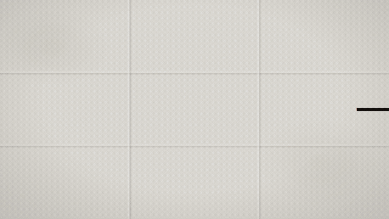
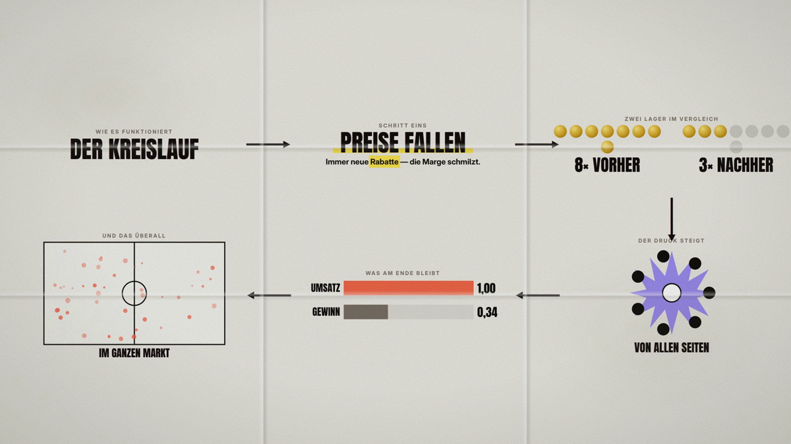

# vox — paper-collage explainer videos from a JSON spec

Renders Vox-style explainer videos: a paper sheet, halftone black-and-white
photo cutouts, flat bold colour shapes, thick black arrows, and a camera that
travels a grid of panels and pulls out at the end to reveal the whole argument.



You describe the video in one `spec.json`. Everything else is generated.



## Why

Bullet points on dark slides *list* claims. This *shows* them: every statement
gets an object, arrows build the causal chain, and the final pull-out proves it
was one connected argument rather than a list.

## Install

Requires `ffmpeg`, `node`, `python3` (with Pillow + numpy), and
[HyperFrames](https://github.com/heygen-com/hyperframes) for rendering.

```bash
git clone https://github.com/bestuserever121/vox-explainer
cd vox-explainer
./voraussetzungen.sh          # checks what is present and what is missing
```

Optional but recommended:

* **`rembg`** — cuts subjects out of photos. Without it, photos stay rectangles
  and the collage look breaks. `python3 -m venv .venv && .venv/bin/pip install "rembg[cpu]" pillow`
* **whisper.cpp** — turns a voiceover into word timings so you know where each
  beat belongs. You can also write the timings by hand.

## Use

```bash
bin/vox.py neu    my-video/     # create a project from the example
bin/vox.py bauen  my-video/     # images, scene, audio, export
```

Or step by step: `bilder` (prepare photos) · `szene` (render) · `ton` (mix audio).

## The spec

```jsonc
{
  "name": "my-video",
  "masse": [1920, 1080],
  "fps": 30,
  "dauer": 24.0,
  "raster": [3, 2],                    // columns × rows of panels
  "palette": { "papier": "#e9e6e1", "koralle": "#f0664a", "...": "..." },
  "felder": [                          // one panel per claim, in camera order
    { "art": "titel",    "bei": 0.0,  "kicker": "How it works", "titel": "THE CYCLE" },
    { "art": "wort",     "bei": 4.0,  "wort": "PRICES FALL", "balken": "gelb",
      "unter": "Ever more <mark>discounts</mark>.", "unter_bei": 2.4 },
    { "art": "zaehler",  "bei": 8.0,  "reihen": [{ "name": "BEFORE", "wert": 8, "max": 8 }] },
    { "art": "umringt",  "bei": 12.0, "wort": "FROM ALL SIDES", "gegner": 7 },
    { "art": "balken",   "bei": 16.0, "max": 1.0,
      "reihen": [{ "name": "REVENUE", "wert": 1.0, "bei": 1.6 }] },
    { "art": "streuung", "bei": 20.0, "wort": "ACROSS THE MARKET", "punkte": 42 }
  ],
  "schluss": { "bei": 22.4, "dauer": 1.5 },   // pull out to the whole sheet
  "ton": { "stimme": "voice.ogg", "bett": "ruhig", "ziel_lufs": -14 }
}
```

`bei` is when the camera arrives at that panel; everything inside animates
relative to it. Panels are laid out in a snake path (right, down, left, down …)
and arrows are drawn between them automatically.

Panel types: `titel` · `wort` · `zaehler` · `objekte` · `balken` · `umringt` ·
`streuung`. See [docs/spec.md](docs/spec.md) for every field.

## Audio

`ton.stimme` is your voiceover. The bed (`ruhig`, `warm`, `spannung`, `hell`) is
synthesised from tuned sine tones — no samples, no third-party rights. It is
placed ~20 LU under the voice by **measuring both**, not by a fixed dB value,
then side-chained so it ducks under speech. Output is normalised to −14 LUFS in
two passes.

## Notes

* Code comments are in German — that is the author's working language. The spec
  format, this README and the docs are English.
* The style is inspired by the visual language of explainer journalism. It is
  not affiliated with, endorsed by, or derived from any publisher's assets.
* Bring your own photos and check their licences. Nothing is bundled.

## Licence

MIT — see [LICENSE](LICENSE).
